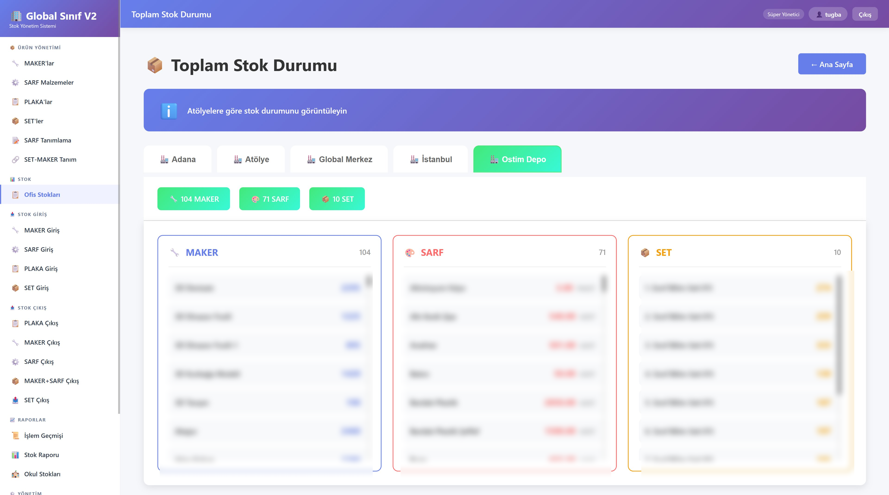
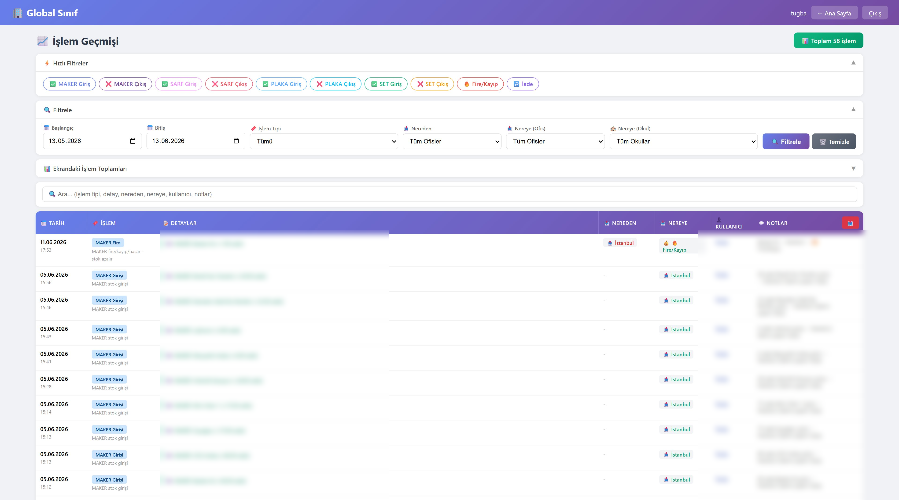
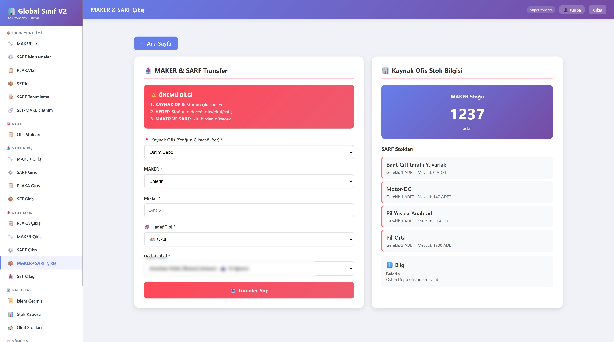
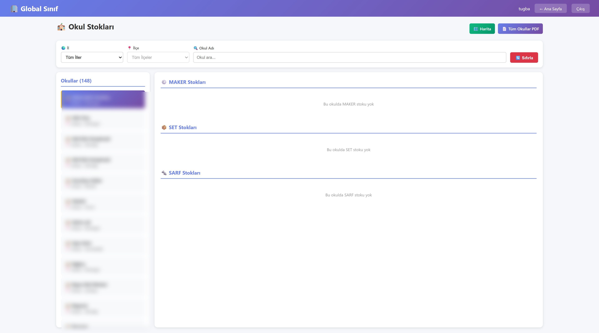

# GlobalMS — Stock Management System

A full-stack inventory and stock management system built end-to-end for
**Global Sınıf Science Center**, deployed to production and used to track
materials across multiple branches and 148 schools.

> **Note:** This repository documents the project (screenshots & overview).
> The source code is kept private as this is a client system. Data in the
> screenshots has been blurred for confidentiality.

🔗 **Live:** stok.globalsinif.com

---

## Tech Stack

- **Backend:** ASP.NET Core MVC, C#, Entity Framework Core
- **Frontend:** Razor, JavaScript, Bootstrap, jQuery
- **Database:** MySQL
- **Infrastructure:** Linux server, Google Geocoding API, automated backups (cron + mysqldump + rclone → Google Drive)

---

## Key Features

- **Multi-branch stock tracking** across offices, warehouses, and 148 schools
- **Three stock categories** — MAKER, SARF (consumables), and SET — each managed independently
- **Stock transfers** between source office and target school/office, with automatic stock deduction and availability checks
- **Full transaction history** with quick filters, date-range filtering, search, and per-category breakdowns
- **Interactive map** (Google Geocoding API) showing every school with stock status
- **Role-based access control** (Superadmin / Admin / Manager / User)
- **CSRF protection** across all controllers
- **Reports** — printable PDF exports and school-level stock views

---

## Engineering Highlights

- Designed and built the full system from database schema to deployment
- Administered the production Linux server (resolved MySQL out-of-memory issues via swap configuration, fixed server timezone)
- Built an automated nightly MySQL backup pipeline with 30-day cloud retention
- Integrated Google Geocoding API to place 148 schools on an interactive map

---

## Screenshots

### School Map — 148 locations with stock status

### Total Stock Dashboard — multi-branch, three categories

### Transaction History — filtering, search & per-category breakdown

### Stock Transfer — source office → target school with auto stock check

### School Stocks — list with city/district filtering

